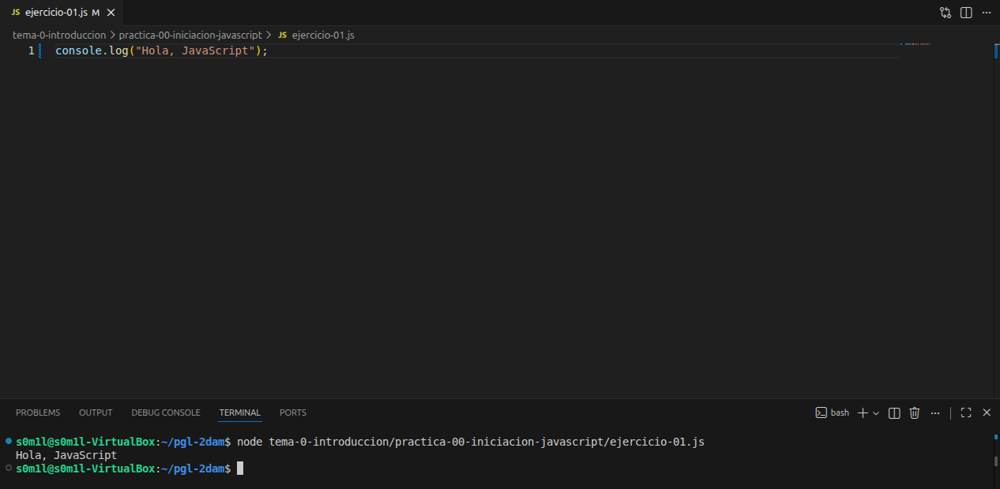
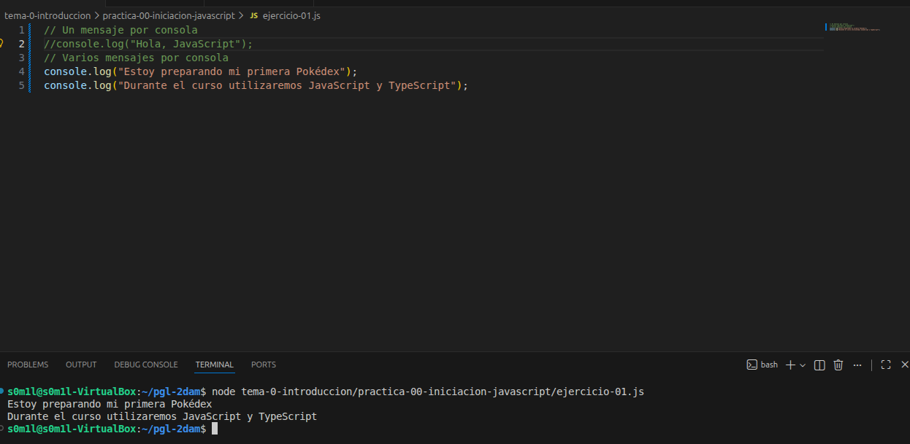
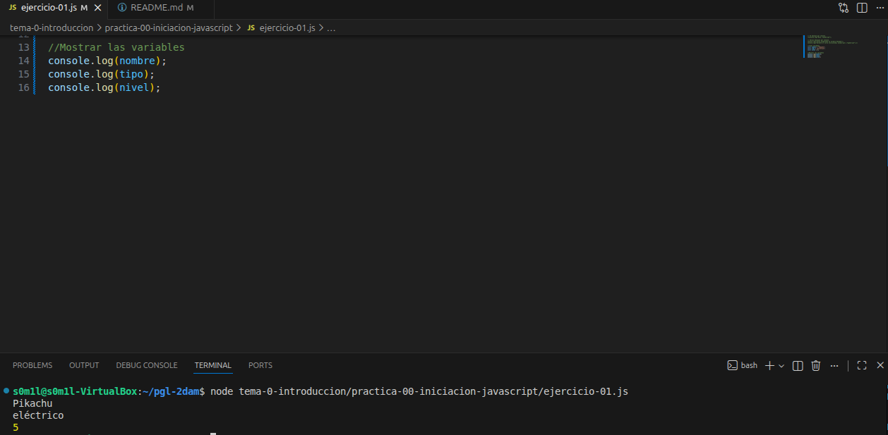
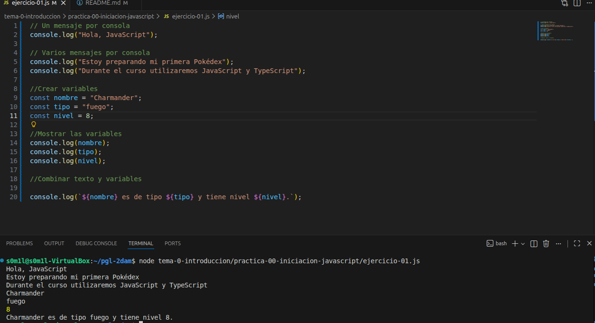
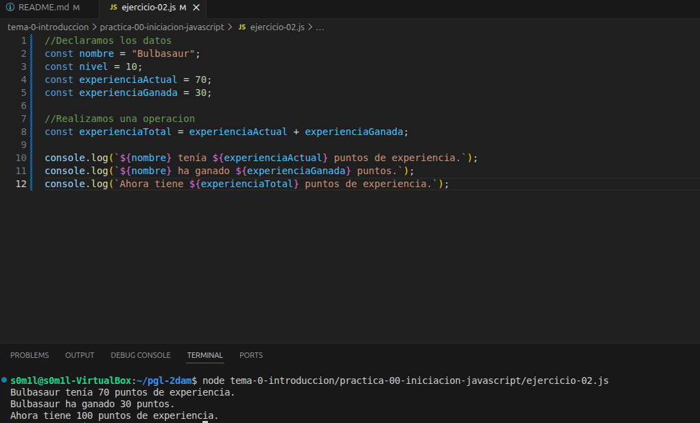
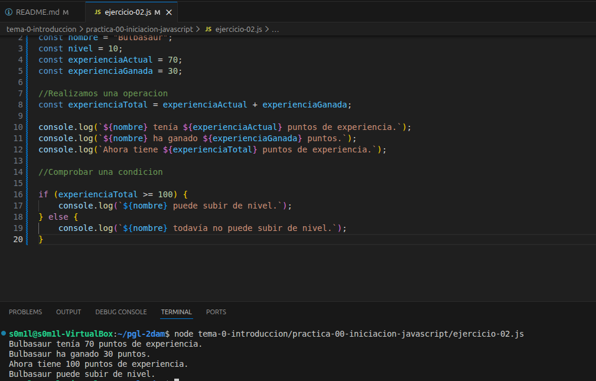
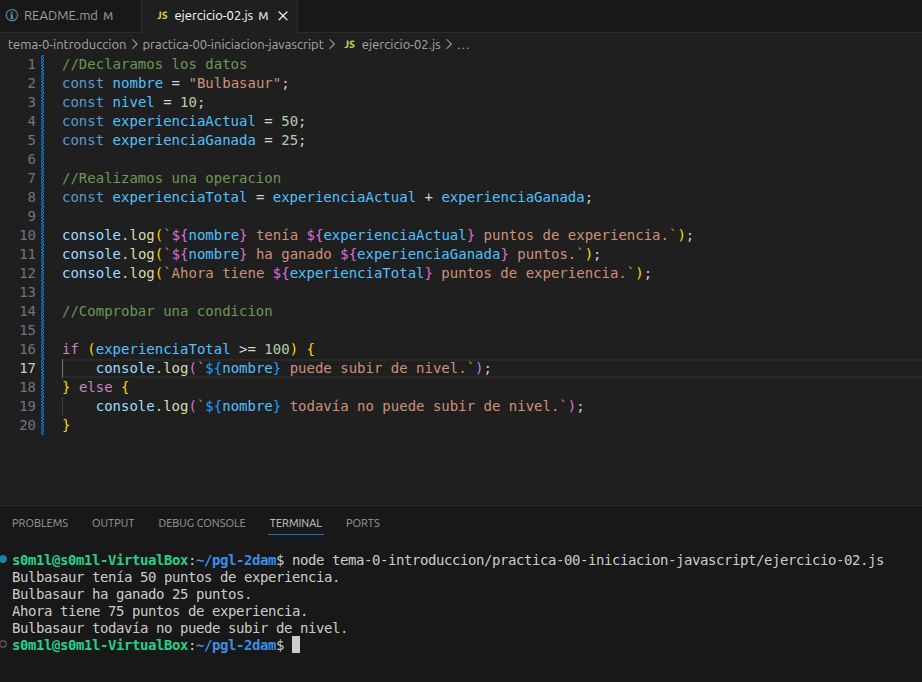

# Práctica 00. Iniciación a JavaScript

## Objetivos

En esta práctica he preparado el repositorio del módulo y he tenido una primera toma de contacto con JavaScript.

# Ejercicio 1. Mi primer programa
## Paso 1. Mostrar un mensaje en la consola
Ponemos lo siguiente:

```js
console.log("Hola, JavaScript");
```
Ejecutamos siempre lo siguiente para comprobar que funciona en este primer ejercicio:

`` node tema-0-introduccion/practica-00-iniciacion-javascript/ejercicio-01.js``

Comprobación hecha:



## Paso 2. Mostrar varios mensajes en la consola
Ponemos:
```js
console.log("Estoy preparando mi primera Pokédex");
console.log("Durante el curso utilizaremos JavaScript y TypeScript");
```

Comprobamos y vemos los mensajes en la consola:



## Paso 3. Crear variables

Una variable sirve para guardar un valor y poder utilizarlo más adelante:

```js
const nombre = "Pikachu";
const tipo = "eléctrico";
const nivel = 5;
```
- Los textos van entre comillas pero los números no.
- ``const`` se utiliza para declarar una variable cuyo valor no se reasignará.
- Cada instrucción termina con ``;``.

## Paso 4. Mostrar las variables

```js
console.log(nombre);
console.log(tipo);
console.log(nivel);
```

Comprobamos que aparezcan por consola:



También podemos combinar texto y variables mediante una plantilla de texto:

```js
console.log(`${nombre} es de tipo ${tipo} y tiene nivel ${nivel}.`);
```


Las plantillas se utilizan con acentos graves: `` ` ``.

## Paso 5. Cambiar los datos

Cambio los valores anteriores por los de otro Pokémon. Por ejemplo:

```js
const nombre = "Charmander";
const tipo = "fuego";
const nivel = 8;
```

Comprobación final: 



# Ejercicio 2. Operaciones y decisiones básicas
Abrimos ``ejercicio-02.js``
## Paso 1. Declarar los datos
```js
const nombre = "Bulbasaur";
const nivel = 10;
const experienciaActual = 70;
const experienciaGanada = 30;
```
## Paso 2. Realizamos una operación
```js
const experienciaTotal = experienciaActual + experienciaGanada;

console.log(`${nombre} tenía ${experienciaActual} puntos de experiencia.`);
console.log(`${nombre} ha ganado ${experienciaGanada} puntos.`);
console.log(`Ahora tiene ${experienciaTotal} puntos de experiencia.`);
```
Comprobamos que la operación se realizó correctamente:



## Paso 3. Comprobar una condición
Una condición permite al programa elegir qué acción realizar según una situación determinada.

```js
if (experienciaTotal >= 100) {
    console.log(`${nombre} puede subir de nivel.`);
} else {
    console.log(`${nombre} todavía no puede subir de nivel.`);
}
```
La condición ``experienciaTotal >= 100`` pregunta si la experiencia total es mayor o igual que 100.

- Si se cumple, se ejecuta el bloque de ``if``.
- Si no se cumple, se ejecuta el bloque de ``else``.

En este caso, como la experiencia total es igual a 100, se ejecutará el bloque ``if``:



## Paso 4. Experimentación

Modificamos ``experienciaActual`` y ``experienciaGanada``:

```js
const nombre = "Bulbasaur";
const nivel = 10;
const experienciaActual = 50;
const experienciaGanada = 25;
```
Ahora, como la experiencia total es menor a 100, se ejecutará el bloque ``else``:



## Conceptos utilizados

``console.log()``: Muestra información en la consola.

Variable: Guarda un dato para poder utilizarlo después.

Texto: Conjunto de caracteres escrito entre comillas.

Número: Valor numérico que se puede utilizar para realizar operaciones.

Condición: Comprueba si se cumple una determinada situación.

## Dificultades encontradas

La verdad que no he encontrado ningún problema ya que lo hecho en los dos ejercicios me sonaba del anterior curso.

## Conclusión

He aprendido los conceptos básicos de JavaScript, como utilizar variables, mostrar información con ``console.log()``, trabajar con texto y números, y utilizar condiciones para que el programa pueda tomar decisiones.