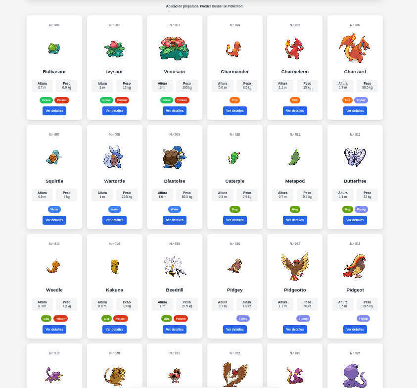
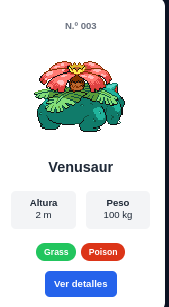
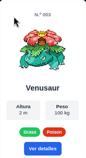
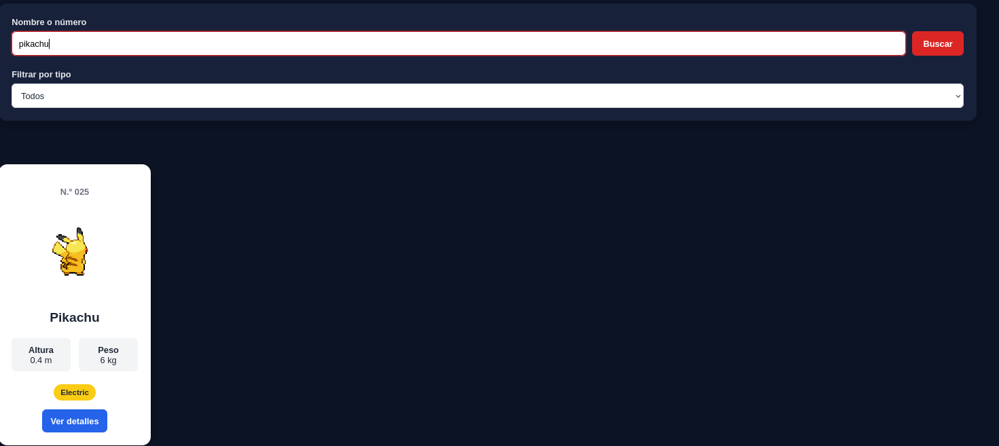
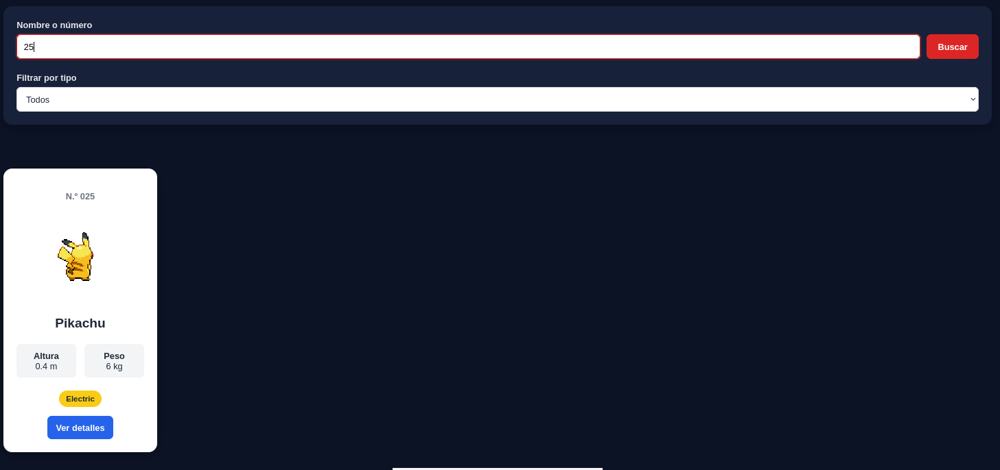
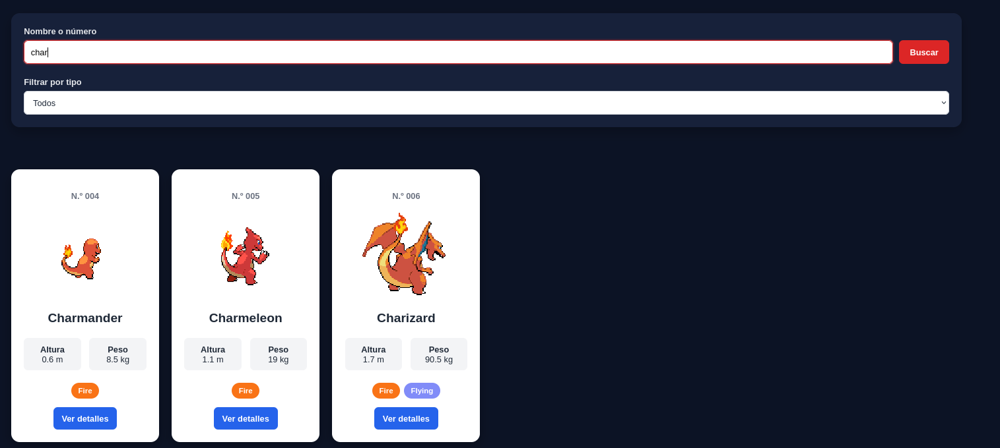
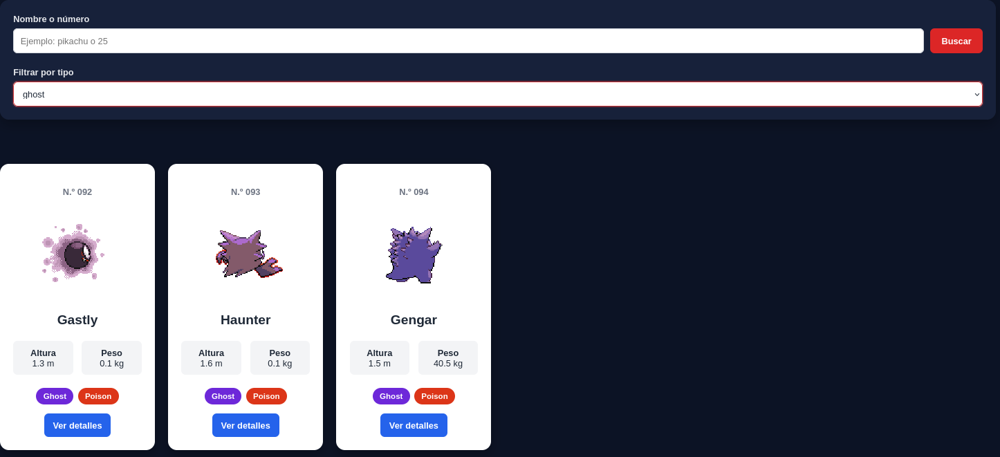
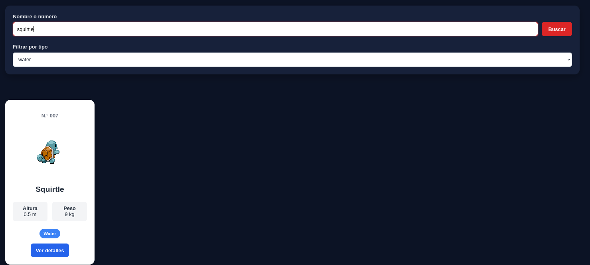
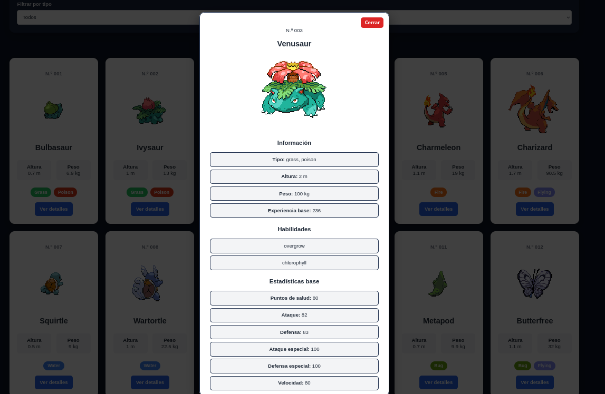

# Pokédex

Somil Vasandani Dhanwani 2º DAM

## Descripción

Aplicación web que permite consultar y explorar los 151 Pokémon de la primera generación utilizando PokéAPI.

La aplicación muestra los Pokémon mediante tarjetas y permite buscar por nombre, número o fragmento del nombre. También incluye un filtro por tipo y una sección de información ampliada para consultar más datos de cada Pokémon.

## Punto de partida

La mini-Pokédex es una pequeña página web que permite buscar un Pokémon escribiendo su nombre o número. La aplicación se conecta a PokéAPI, una API que proporciona información sobre los Pokémon.

El funcionamiento básico es:

1. El usuario escribe, por ejemplo, pikachu o 25.

2. JavaScript recoge y limpia ese dato.

3. Se hace una petición a PokéAPI usando fetch().

4. La API devuelve los datos del Pokémon en formato JSON.

5. JavaScript selecciona la información que necesitamos: nombre, número, imagen, altura, peso y tipos.

6. Finalmente, esos datos se muestran en una tarjeta HTML.

7. Si la búsqueda está vacía o el Pokémon no existe, se muestra un mensaje de error.

Insertamos un pokemon, en mi caso Charmander, y pulsamos el boton de buscar: 


Ahora probamos poniendo un pokemon inexistente:


Enlace al commit de la práctica pre-pokedex: https://github.com/somilvd/mini-pokedex/tree/9205d9357a71ad0beb9c76b4653c9771d48856a6


# 2. Carga de los 151 Pokémon

## Cambios realizados

Partiendo de la mini-Pokédex inicial, se modificó la aplicación para cargar automáticamente los 151 Pokémon de la primera generación.

En lugar de realizar una petición únicamente cuando el usuario buscaba un Pokémon, se realizan peticiones para obtener los Pokémon desde el número 1 hasta el 151.

Para ello se utilizó un bucle:

    for (let id = 1; id <= 151; id++) {
        peticiones.push(obtenerPokemon(id));
    }

Las peticiones se almacenan en un array y posteriormente se utiliza `Promise.all()` para esperar a que todas terminen:

    pokemons = await Promise.all(peticiones);

De esta forma se obtiene una colección con los 151 Pokémon.

## Transformación de los datos

La función `obtenerPokemon()` consulta PokéAPI y selecciona únicamente los datos necesarios para la aplicación.

    return {
        id: datos.id,
        nombre: datos.name,
        imagenFrontal: datos.sprites.front_default,
        imagenTrasera: datos.sprites.back_default,
        altura: datos.height,
        peso: datos.weight,
        tipos: datos.types.map(({ type }) => type.name),
        experiencia: datos.base_experience,
        habilidades: datos.abilities.map(({ ability }) => ability.name),
        estadisticas: datos.stats.map(({ base_stat, stat }) => ({
            nombre: stat.name,
            valor: base_stat
        })),
    };

De esta manera, en lugar de trabajar directamente con toda la información proporcionada por la API, se crea un objeto más sencillo y adaptado a las necesidades de la aplicación.

## Problemas encontrados y soluciones

Uno de los cambios principales fue pasar de mostrar un único Pokémon a trabajar con una colección de 151 elementos.

Para solucionarlo se creó la variable:

    let pokemons = [];

Esta variable almacena todos los Pokémon cargados y posteriormente permite realizar búsquedas y filtros sobre ellos sin tener que volver a consultar la API.

También fue necesario utilizar `Promise.all()` para esperar a que todas las peticiones finalizaran antes de mostrar la colección.

## Resultado

Una vez cargados los datos, se muestran los 151 Pokémon en forma de tarjetas.



# 3. Construcción de las tarjetas

## Datos seleccionados de PokéAPI

Cada tarjeta muestra información básica del Pokémon:

- Número de la Pokédex.
- Nombre.
- Imagen.
- Altura.
- Peso.
- Tipo o tipos.
- Botón para consultar los detalles.

Los datos se obtienen directamente desde PokéAPI y se transforman antes de utilizarlos en la interfaz.

## Generación de las tarjetas

Para crear las tarjetas se creó la función:

    const crearTarjeta = (pokemon) => {

Esta función recibe un Pokémon y devuelve el código HTML necesario para representar su tarjeta.

Los tipos se generan utilizando `map()`:

    const tiposHTML = pokemon.tipos
        .map((tipo) => `<span class="tipo">${tipo}</span>`)
        .join("");

La función `mostrarPokemons()` utiliza todos los Pokémon de la lista y genera sus tarjetas:

    resultado.innerHTML = lista
        .map((pokemon) => crearTarjeta(pokemon))
        .join("");

Esto permite generar automáticamente todas las tarjetas sin escribirlas manualmente en HTML.

## Cambio entre sprite trasero y frontal

Cada Pokémon dispone de dos imágenes:

    imagenFrontal: datos.sprites.front_default,
    imagenTrasera: datos.sprites.back_default,

La tarjeta comienza mostrando el sprite trasero.

Cuando el cursor entra en la tarjeta se cambia al sprite frontal:

    tarjeta.addEventListener("mouseenter", () => {
        imagen.src = pokemon.imagenFrontal;
    });

Cuando el cursor sale de la tarjeta, vuelve a mostrarse el sprite trasero:

    tarjeta.addEventListener("mouseleave", () => {
        imagen.src = pokemon.imagenTrasera;
    });

El cambio se realiza utilizando las imágenes que ya se habían recibido de la API, por lo que no es necesario realizar una nueva petición.

## Resultado normal



## Resultado al pasar el cursor




# 4. Barra de búsqueda y filtros

## Búsqueda

Se añadió una barra de búsqueda que permite localizar Pokémon mediante:

- Nombre completo.
- Número de la Pokédex.
- Fragmento del nombre.

Por ejemplo:

    pikachu
    25
    char

La búsqueda se normaliza utilizando `trim()` y `toLowerCase()`:

    const busqueda = inputBusqueda.value
        .trim()
        .toLowerCase();

`trim()` elimina los espacios innecesarios y `toLowerCase()` permite que la búsqueda no dependa de las mayúsculas o minúsculas.

## Búsqueda por fragmento

Para permitir búsquedas como `char`, se utiliza `includes()`:

    pokemon.nombre.includes(busqueda)

Por ejemplo, una búsqueda de `char` encuentra a:

    charizard, charmander y charmeleon

También se permite buscar mediante el número exacto:

    String(pokemon.id) === busqueda

## Filtro por tipo

También se añadió un selector para filtrar los Pokémon según su tipo.

Las opciones del selector se generan a partir de los tipos presentes en los Pokémon cargados, por lo que no es necesario escribir manualmente todos los tipos.

## Combinación de búsqueda y filtro

La búsqueda y el filtro funcionan simultáneamente.

Primero se comprueba si el Pokémon coincide con la búsqueda:

    const coincideBusqueda =
        !busqueda ||
        pokemon.nombre.includes(busqueda) ||
        String(pokemon.id) === busqueda;

Después se comprueba si coincide con el tipo seleccionado:

    const coincideTipo =
        tipoSeleccionado === "todos" ||
        pokemon.tipos.includes(tipoSeleccionado);

Finalmente, solo se muestran los Pokémon que cumplen ambas condiciones:

    return coincideBusqueda && coincideTipo;

Esto permite realizar búsquedas como:

    Buscar: char
    Tipo: fire

y obtener únicamente los Pokémon que cumplen ambas condiciones.

## Búsqueda sin resultados

Cuando no existe ningún Pokémon que coincida con la búsqueda o con el filtro, se vacía el contenedor de resultados:

    resultado.innerHTML = "";

y se muestra un mensaje:

    mensaje.textContent = "No se ha encontrado ningún Pokémon.";

Cuando la barra de búsqueda vuelve a estar vacía, se vuelven a mostrar los Pokémon que correspondan al filtro seleccionado.

## Pruebas realizadas

### Búsqueda por nombre

    pikachu

Resultado esperado: aparece Pikachu.



### Búsqueda por número

    25

Resultado esperado: aparece Pikachu.



### Búsqueda por fragmento

    char

Resultado esperado: aparecen los Pokémons cuyo nombre contiene ese fragmento.



### Filtro por tipo

Se seleccionó un tipo, en mi caso "ghost", y se comprobó que únicamente aparecen Pokémons de ese tipo.



### Combinación de búsqueda y filtro

Se utilizó simultáneamente una búsqueda y un tipo para comprobar que ambos filtros funcionan juntos.



# 5. Información ampliada

## Panel de detalles

Cada tarjeta dispone de un botón:

    Ver detalles

Al pulsarlo se abre un panel con información ampliada del Pokémon.

El panel se genera dinámicamente mediante JavaScript y no es necesario recargar la página.

## Información mostrada

El panel incluye:

- Nombre.
- Número de Pokédex.
- Imagen frontal en mayor tamaño.
- Tipo o tipos.
- Altura.
- Peso.
- Experiencia base.
- Habilidades.
- Estadísticas base.

Las estadísticas mostradas son:

- Puntos de salud.
- Ataque.
- Defensa.
- Ataque especial.
- Defensa especial.
- Velocidad.

## Habilidades

Las habilidades se transforman en elementos HTML utilizando `map()`:

    const habilidadesHTML = pokemon.habilidades
        .map((habilidad) => `<li>${habilidad}</li>`)
        .join("");

## Estadísticas

Las estadísticas obtenidas desde PokéAPI también se recorren mediante `map()`.

Se traducen los nombres de las estadísticas para mostrarlas de forma más comprensible:

    if (nombre === "hp") {
        nombre = "Puntos de salud";
    }

    if (nombre === "attack") {
        nombre = "Ataque";
    }

    if (nombre === "defense") {
        nombre = "Defensa";
    }

## Cierre del panel

El panel incluye un botón `Cerrar`.

Al pulsarlo se elimina el panel del DOM:

    botonCerrar.addEventListener("click", () => {
        panel.remove();
    });

Por tanto, el usuario puede cerrar la información ampliada sin recargar la página.

## Panel abierto




# 6. Gestión de estados y errores

La aplicación tiene diferentes estados durante su funcionamiento.

## Aplicación preparada

Al abrir la aplicación, se muestra la interfaz con la barra de búsqueda y el selector de tipos.

El usuario puede comenzar a buscar o consultar directamente los Pokémon cargados.

## Datos cargándose

Mientras se realizan las peticiones para obtener los 151 Pokémon, se muestra:

    Cargando Pokémon...

Esto permite informar al usuario de que la aplicación está trabajando.

El mensaje se establece mediante:

    mensaje.textContent = "Cargando Pokémon...";

## Datos cargados correctamente

Cuando todas las peticiones terminan correctamente, se muestran las tarjetas:

    pokemons = await Promise.all(peticiones);

    mostrarPokemons(pokemons);

    mensaje.textContent = "";

De esta manera se elimina el mensaje de carga cuando los datos están disponibles.

## Búsqueda sin resultados

Si una búsqueda o combinación de filtros no encuentra ningún Pokémon, el contenedor se vacía:

    resultado.innerHTML = "";

y se muestra:

    No se ha encontrado ningún Pokémon.

## Error al comunicarse con PokéAPI

Las peticiones a la API se encuentran dentro de un bloque `try...catch`.

Si ocurre un problema, se muestra un mensaje comprensible:

    try {
        // Peticiones a la API
    } catch (error) {
        mensaje.textContent = "No se han podido cargar los Pokémon.";
    }

De esta forma no se muestra directamente al usuario un error técnico como `undefined` o `[object Object]`.

Además, la aplicación no queda bloqueada y el usuario puede volver a intentarlo.

## Pruebas realizadas

Se comprobaron los siguientes casos:

- Carga inicial de los 151 Pokémon.
- Búsqueda de un Pokémon existente.
- Búsqueda sin resultados.
- Búsqueda con el campo vacío.
- Uso del filtro por tipo.
- Combinación de búsqueda y filtro.
- Consulta de detalles.
- Cierre del panel de detalles.
- Funcionamiento de la aplicación después de una búsqueda con error.

# 7. Pruebas finales

Se conseguieron los requisitos que se pedían:

- El funcionamiento de la búsqueda.
- La combinación entre búsqueda y filtro.
- El filtrado por tipo.
- La distribución de las tarjetas en pantalla.
- La separación visual entre los elementos.
- El cambio entre los sprites trasero y frontal.
- La gestión de errores y estados.
- La apariencia del selector de tipos.
- La adaptación de la cuadrícula a diferentes tamaños de pantalla.

# 8. Conclusiones

## Dificultades encontradas

Fue necesario aprender a trabajar con arrays de objetos y utilizar métodos como `map()`, `filter()` y `join()` para transformar y mostrar la información.

Otra dificultad fue combinar correctamente la búsqueda por nombre o número con el filtro por tipo, ya que ambos deben aplicarse al mismo tiempo.

También fue necesario controlar los diferentes estados de la aplicación y gestionar los errores para evitar que la interfaz quedase bloqueada.

# Modificaciones Finales

## Ejercicio 1. Contador de resultados

1. En el index.html: Ponemos esto donde queramos que aparezca el contador, en mi caso, lo puse debajo del formulario:
```html
<p id="contador-resultados"></p>
```
2. Añadí junto a las demás constantes:
```js
const contadorResultados = document.querySelector("#contador-resultados");
```

3. En filtrarPokemons()
Justo después de crear resultados: 

```js
contadorResultados.textContent =
    `Resultados encontrados: ${resultados.length}`;
Quedaría así:
const resultados = pokemons.filter((pokemon) => {
    // ...
});
```
```js
contadorResultados.textContent =
    `Resultados encontrados: ${resultados.length}`;
```
Nota: El contador sale después de buscar cualquier cosa.

## Ejercicio 3. 